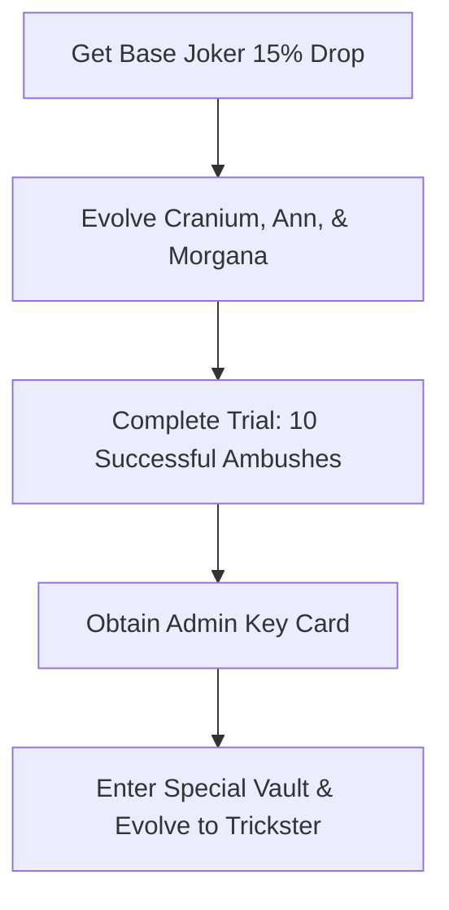

import { Map, Swords, Trophy, Target, Shield, Sparkles } from 'lucide-react'
import { Callout } from '@/components/mdx/Callout'
import { Card, CardGrid } from '@/components/mdx/CardGrid'
import { Checklist } from '@/components/mdx/Checklist'
import { FAQ } from '@/components/mdx/FAQ'
import { Steps, Step } from '@/components/mdx/Steps'
import { Section } from '@/components/mdx/Section'
import { YouTubeEmbed } from '@/components/mdx/YouTubeEmbed'

export const metadata = {
  title: "Anime Universe Tower Defense Boundless Joker: Expedition Guide",
  description: "Learn how to unlock and evolve the 0.1% Boundless Joker (Trickster) in the Anime Universe Tower Defense Expedition Mode with our step-by-step guide.",
  category: "Guide",
  image: "https://placehold.co/800x400/1e1b4b/fff?text=Boundless+Joker+Guide",
  date: "2026-07-11",
  author: "universal tower defense Wiki Team"
}

<Callout type="info" title="Quick Guide">
- **Boundless Joker**: Unlock the 0.1% drop rate **Boundless Joker** (Trickster) by defeating the Golden Palace boss.
- **Expedition Mode**: Learn to navigate the Persona-themed stealth dungeon, bypass shadows, and collect keys.
- **Evolution System**: Gather specific Arcana cards and evolve Cranium, Ann, and Morgana to unlock Joker's true potential.
- **Team Synergy**: Equip multiple Phantom-tagged units to trigger massive damage multipliers and follow-up attacks.
- **Active Ambush**: Maximize your upgrades to unlock the active Ambush phase, turning real-time combat into turn-based tactical strikes.
</Callout>

<Section icon={Map} title="Anime Universe Tower Defense Boundless Joker Overview">

The Persona-themed update introduces the highly anticipated **anime universe tower defense boundless joker** (known in-game as Trickster). As a Boundless-tier unit, Joker possesses some of the most complex tactical mechanics in the game, completely changing how high-end setups operate. 

To obtain him, players must dive into the new Expedition Mode (specifically the Golden Palace map), master stealth mechanics, defeat elite guards, and challenge the False King boss. 

**Video Highlights:**
- **Stealth Mechanics**: Learn how to utilize hiding spots and dash to avoid patrol sightlines.
- **Boss Encounter**: Watch the complete False King boss fight and learn positioning strategies.
- **Evolution Path**: See the exact requirements needed to evolve Joker into his final form.
- **Showcase**: Observe the Phantom synergy and the unique turn-based Ambush active ability in action.

<YouTubeEmbed videoId="Scrqko9MBuA" title="Getting The 0.1% BOUNDLESS JOKER In Anime Universe Tower Defense!" />

### Expedition Entry Requirements

Before hunting for Joker, familiarize yourself with the loadout constraints. Unlike standard modes, Expedition limits your team based on a strict point budget.

| Unit Rarity | Point Cost |
| :--- | :--- |
| **Boundless / Secret** | 50 Points / 30 Points |
| **Mythic** | 15 Points |
| **Legendary** | 5 Points |
| **Epic** | 3 Points |
| **Max Budget** | **100 Points** |

<Callout type="warning" title="Stealth Warning">
If a Shadow patrol spots you, their detection meter fills rapidly. Break their line of sight immediately or prepare to be dragged into a forced combat encounter.
</Callout>

</Section>

<Section icon={Target} title="How to Farm the Golden Palace and Unlock Joker">

Unlocking the **anime universe tower defense boundless joker** requires a mix of stealth, key gathering, and boss farming. The base drop rate for Joker from the False King boss is approximately 15%, but a pity system guarantees his drop within 8 successful runs.

### Golden Palace Progression Flow

| Stage Area | Objective | Key Reward |
| :--- | :--- | :--- |
| **Palace Halls** | Sneak past Shadows or execute Ambushed fights | Bronze Keys & Gold |
| **Locked Rooms** | Use keys to unlock Vaults containing Arcana Chests | Cranium, Ann, Morgana |
| **Elite Rooms** | Defeat purple Elite Guards to secure Evolution Items | Chariot, Lovers, Magician Evos |
| **Boss Sanctum** | Accumulate 10/10 points to unlock and defeat False King | Boundless Joker (Trickster) |

<Steps>
  <Step num="1" title="Initiate Stealth and Gather Keys">
    Navigate the corridors using the red hiding zones. Sneak up behind patrolling Shadows and press the interact key to trigger an Ambush, starting the battle with a massive tactical advantage.
  </Step>
  <Step num="2" title="Clear Elite Encounters">
    Locate Elite Guards (distinguished by their purple aura). Defeating them rewards you with Elite Keys. Use these keys on locked side-rooms to choose your Arcana rewards: Chariot, Lovers, or Magician.
  </Step>
  <Step num="3" title="Unlock the Boss Room">
    You must accumulate 10 active points by clearing rooms and defeating guards to open the Boss Sanctum. Once unlocked, face the False King in a 15-wave defense encounter. Defeat him and head directly to the Extraction Zone to claim your loot.
  </Step>
</Steps>

<Callout type="tip" title="Extraction Security">
You must successfully reach the Extraction Zone and complete the final defense wave to keep your rewards. Leaving early or dying will forfeit all units and evolution items acquired during the run.
</Callout>

</Section>

<Section icon={Sparkles} title="Evolution Requirements and Stats Transfer">

Once you obtain the base Joker unit, you must complete a series of trials and evolve his Phantom companions to awaken him into his ultimate form. 

### Phantom Companion Evolution Data

| Unit Name | Arcana Card | Evo Item Required | Special Ability |
| :--- | :--- | :--- | :--- |
| **Cranium** | Chariot | Chariot Arcana | Applies Electrify and boosts Critical Damage |
| **Ann** | Lovers | Lovers Arcana | Inflicts Burn and slows distant enemies |
| **Morgana** | Magician | Magician Arcana | Inflicts Windshear and triggers Lucky Punch |

### Step-by-Step Evolution Process

<Callout type="success" title="Stat Optimization Tip">
Before evolving Joker, utilize the Mining Room to gather High-Tier Stat Chips. Transfer S-tier Damage and Range stats to Joker prior to his final awakening to maximize his base multipliers.
</Callout>

</Section>

<Section icon={Swords} title="Trickster Joker Abilities & Phantom Synergy">

When fully upgraded, Joker transforms the battlefield. He acts as the ultimate buffer and DPS driver for all Phantom-tagged units in your loadout.

### Joker's Base Attack Upgrades

| Upgrade Level | Damage Output | Range | SPA | Special Effect |
| :--- | :--- | :--- | :--- | :--- |
| **Level 1** | 5,200 | 25 | 6.5s | Single Target Gunshot |
| **Level 4** | 45,000 | 40 | 5.5s | Summons Phantom Companion |
| **Max Level** | 235,000 | 65 | 4.5s | Unlocks Active Ambush Ability |

### Phantom Synergy Multipliers

CardGrid allows you to visualize how each companion alters Joker's performance:

<CardGrid cols={3}>
  <Card title="Cranium Synergy">
    - **Damage Buff**: Grants +50% damage to all units in Ambush.
    - **Electrify**: Deals 25% damage over 5 ticks.
    - **Crit Boost**: Increases Crit Rate by 15%.
  </Card>
  <Card title="Ann Synergy">
    - **Burn Amplification**: Increases damage by 25% on afflicted targets.
    - **Crowd Control**: Slows target pathing by 30%.
    - **Stun Utility**: Applies a 4-second stun window.
  </Card>
  <Card title="Morgana Synergy">
    - **Lucky Punch**: 50% chance to deal triple critical damage.
    - **Windshear**: Deals 350% damage over 7 ticks.
    - **Follow-up**: Triggers automatic 50% damage strikes.
  </Card>
</CardGrid>

<Callout type="info" title="The Active Ambush Mechanic">
When Joker reaches Max Upgrade, activating his skill initiates a turn-based tactical phase. Time freezes for 20 seconds, allowing your placed Phantoms to execute high-damage skills (E-ha, Buofu, and Garu) without taking damage from incoming waves.
</Callout>

</Section>

<Section icon={Trophy} title="Expedition Goals Checklist">

Use this checklist to track your progress as you farm for the ultimate Phantom Thief setup in the Golden Palace.

<Checklist
  id="joker-progression"
  title="Phantom Thief Milestones:"
  items={[
    "Accumulate 100 loadout points to optimize your speedrun team",
    "Acquire base Joker from the False King boss (15% drop rate)",
    "Unlock and evolve Cranium, Ann, and Morgana using their respective Arcana cards",
    "Complete the 10-Ambush trial in a single Golden Palace run",
    "Acquire the Special Key Card to unlock the final Evolution Sanctum",
    "Evolve Joker into Trickster and equip the Warlord Chip set"
  ]}
/>

</Section>

<Section icon={Shield} title="Frequently Asked Questions">

<FAQ items={[
  {
    question: "What is the best loadout budget for farming the Golden Palace?",
    answer: "Since your budget is capped at 100 points, we recommend running one strong hybrid DPS unit (like a Mythic at 15 points) to deal with air units, a money generator (like Bulma or Speaker Idol), and leaving the rest of the points open for utility units."
  },
  {
    question: "How do I fix the 10-Ambush trial if my counter is bugged?",
    answer: "Ensure you are initiating the fight by sneaking behind the Shadow and manually pressing the Ambush button. If the shadow spots you first and triggers the fight, it will not count toward your 10-Ambush trial requirement."
  },
  {
    question: "Does the False King boss have any special mechanics?",
    answer: "The False King possesses a 50 million health shield. However, he remains stationary for long periods, making him highly susceptible to stun setups and high-DPS single-target units."
  },
  {
    question: "Is the anime universe tower defense boundless joker viable for solo play?",
    answer: "Yes. Due to his turn-based Ambush ability which freezes enemy pathing, Joker is one of the premier units for clearing high-difficulty solo trials and infinite modes."
  }
]} />

</Section>