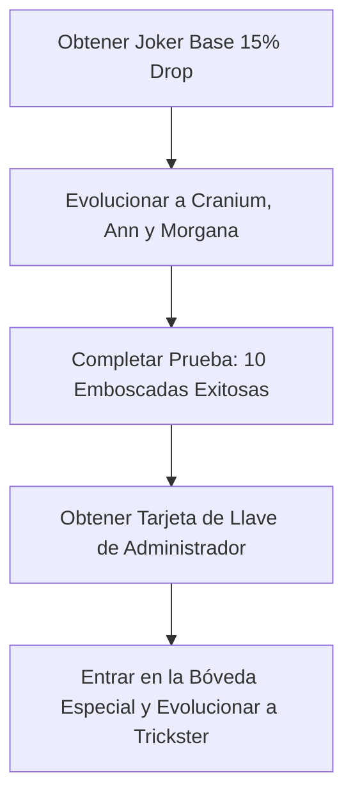

import { Map, Swords, Trophy, Target, Shield, Sparkles } from 'lucide-react'
import { Callout } from '@/components/mdx/Callout'
import { Card, CardGrid } from '@/components/mdx/CardGrid'
import { Checklist } from '@/components/mdx/Checklist'
import { FAQ } from '@/components/mdx/FAQ'
import { Steps, Step } from '@/components/mdx/Steps'
import { Section } from '@/components/mdx/Section'
import { YouTubeEmbed } from '@/components/mdx/YouTubeEmbed'

export const metadata = {
  title: "Anime Universe Tower Defense Boundless Joker: Guía de Expedición",
  description: "Aprende cómo desbloquear y evolucionar al Boundless Joker (Trickster) con una tasa de obtención del 0.1% en el Modo Expedición de Anime Universe Tower Defense con nuestra guía paso a paso.",
  category: "Guía",
  image: "https://placehold.co/800x400/1e1b4b/fff?text=Boundless+Joker+Guide",
  date: "2026-07-11",
  author: "Equipo de la Wiki de Anime Universe Tower Defense",
  keywords: "Anime Universe Tower Defense, Boundless Joker, Guía de Expedición, Trickster, Palacio Dorado"
}

<Callout type="info" title="Guía Rápida">
- **Boundless Joker**: Desbloquea al **Boundless Joker** (Trickster) con una tasa de obtención del 0.1% al derrotar al jefe del Palacio Dorado.
- **Modo Expedición**: Aprende a navegar por la mazmorra de sigilo temática de Persona, esquivar sombras y recolectar llaves.
- **Sistema de Evolución**: Reúne cartas de Arcano específicas y evoluciona a Cranium, Ann y Morgana para desbloquear el verdadero potencial de Joker.
- **Sinergia de Equipo**: Equipa múltiples unidades con la etiqueta Phantom para activar multiplicadores de daño masivos y ataques de seguimiento.
- **Emboscada Activa**: Maximiza tus mejoras para desbloquear la fase activa de Emboscada (Ambush), convirtiendo el combate en tiempo real en ataques tácticos por turnos.
</Callout>

<Section icon={Map} title="Descripción General de Boundless Joker en Anime Universe Tower Defense">

La actualización temática de Persona introduce al muy esperado **anime universe tower defense boundless joker** (conocido en el juego como Trickster). Como unidad de nivel Boundless, Joker posee algunas de las mecánicas tácticas más complejas del juego, cambiando por completo el funcionamiento de las configuraciones de alto nivel.

Para obtenerlo, los jugadores deben sumergirse en el nuevo Modo Expedición (específicamente en el mapa del Palacio Dorado), dominar las mecánicas de sigilo, derrotar a los guardias de élite y desafiar al jefe Rey Falso.

**Puntos Destacados del Video:**
- **Mecánicas de Sigilo**: Aprende a utilizar los escondites y el impulso (dash) para evitar las líneas de visión de las patrullas.
- **Encuentro con el Jefe**: Mira la pelea completa contra el jefe Rey Falso y aprende estrategias de posicionamiento.
- **Ruta de Evolución**: Consulta los requisitos exactos necesarios para evolucionar a Joker a su forma final.
- **Exhibición**: Observa la sinergia Phantom y la habilidad activa única de Emboscada por turnos en acción.

<YouTubeEmbed videoId="Scrqko9MBuA" title="¡Obteniendo al 0.1% BOUNDLESS JOKER en Anime Universe Tower Defense!" />

### Requisitos de Entrada para la Expedición

Antes de ir a por Joker, familiarízate con las restricciones de equipamiento. A diferencia de los modos estándar, la Expedición limita a tu equipo basándose en un presupuesto estricto de puntos.

| Rareza de la Unidad | Coste de Puntos |
| :--- | :--- |
| **Boundless / Secret** | 50 Puntos / 30 Puntos |
| **Mythic** | 15 Puntos |
| **Legendary** | 5 Puntos |
| **Epic** | 3 Puntos |
| **Presupuesto Máximo** | **100 Puntos** |

<Callout type="warning" title="Advertencia de Sigilo">
Si una patrulla de Sombras te detecta, su medidor de detección se llenará rápidamente. Rompe su línea de visión de inmediato o prepárate para ser arrastrado a un encuentro de combate forzado.
</Callout>

</Section>

<Section icon={Target} title="Cómo Farmear el Palacio Dorado y Desbloquear a Joker">

Desbloquear al **anime universe tower defense boundless joker** requiere una combinación de sigilo, recolección de llaves y farmeo del jefe. La tasa de obtención base de Joker del jefe Rey Falso es de aproximadamente el 15%, pero un sistema de "pity" garantiza su obtención en un máximo de 8 partidas exitosas.

### Flujo de Progresión del Palacio Dorado

| Área de la Etapa | Objetivo | Recompensa Clave |
| :--- | :--- | :--- |
| **Pasillos del Palacio** | Esquivar Sombras o ejecutar combates de Emboscada | Llaves de Bronce y Oro |
| **Salas Cerradas** | Usar llaves para abrir Bóvedas que contienen Cofres de Arcanos | Cranium, Ann, Morgana |
| **Salas de Élite** | Derrotar Guardias de Élite púrpuras para asegurar Objetos de Evolución | Evos de Chariot, Lovers, Magician |
| **Santuario del Jefe** | Acumular 10/10 puntos para desbloquear y derrotar al Rey Falso | Boundless Joker (Trickster) |

<Steps>
  <Step num="1" title="Iniciar Sigilo y Recolectar Llaves">
    Navega por los pasillos usando las zonas rojas para esconderte. Acércate sigilosamente por detrás de las Sombras que patrullan y presiona la tecla de interacción para activar una Emboscada, comenzando la batalla con una ventaja táctica masiva.
  </Step>
  <Step num="2" title="Superar Encuentros de Élite">
    Localiza a los Guardias de Élite (distinguidos por su aura púrpura). Derrotarlos te recompensará con Llaves de Élite. Usa estas llaves en las salas laterales cerradas para elegir tus recompensas de Arcano: Chariot, Lovers o Magician.
  </Step>
  <Step num="3" title="Desbloquear la Sala del Jefe">
    Debes acumular 10 puntos activos despejando salas y derrotando guardias para abrir el Santuario del Jefe. Una vez desbloqueado, enfrenta al Rey Falso en un encuentro de defensa de 15 oleadas. Derrótalo y dirígete directamente a la Zona de Extracción para reclamar tu botín.
  </Step>
</Steps>

<Callout type="tip" title="Seguridad de Extracción">
Debes llegar con éxito a la Zona de Extracción y completar la oleada de defensa final para conservar tus recompensas. Salir antes o morir resultará en la pérdida de todas las unidades y objetos de evolución adquiridos durante la partida.
</Callout>

</Section>

<Section icon={Sparkles} title="Requisitos de Evolución y Transferencia de Estadísticas">

Una vez que obtengas la unidad base de Joker, debes completar una serie de pruebas y evolucionar a sus compañeros Phantom para despertarlo en su forma definitiva.

### Datos de Evolución de Compañeros Phantom

| Nombre de Unidad | Carta de Arcano | Objeto Evo Requerido | Habilidad Especial |
| :--- | :--- | :--- | :--- |
| **Cranium** | Chariot | Arcano Chariot | Aplica Electrificación y potencia el Daño Crítico |
| **Ann** | Lovers | Arcano Lovers | Inflige Quemadura y ralentiza a los enemigos lejanos |
| **Morgana** | Magician | Arcano Magician | Inflige Windshear (Corte de Viento) y activa Lucky Punch |

### Proceso de Evolución Paso a Paso

<Callout type="success" title="Consejo de Optimización de Estadísticas">
Antes de evolucionar a Joker, utiliza la Sala de Minería para recolectar Chips de Estadísticas de Nivel Alto. Transfiere estadísticas de Daño y Rango de nivel S a Joker antes de su despertar final para maximizar sus multiplicadores base.
</Callout>

</Section>

<Section icon={Swords} title="Habilidades de Trickster Joker y Sinergia Phantom">

Cuando está completamente mejorado, Joker transforma el campo de batalla. Actúa como el potenciador definitivo y el motor de DPS para todas las unidades con la etiqueta Phantom en tu equipo.

### Mejoras del Ataque Base de Joker

| Nivel de Mejora | Daño | Rango | SPA | Efecto Especial |
| :--- | :--- | :--- | :--- | :--- |
| **Nivel 1** | 5,200 | 25 | 6.5s | Disparo a un Solo Objetivo |
| **Nivel 4** | 45,000 | 40 | 5.5s | Invoca Compañero Phantom |
| **Nivel Máx** | 235,000 | 65 | 4.5s | Desbloquea Habilidad de Emboscada Activa |

### Multiplicadores de Sinergia Phantom

CardGrid te permite visualizar cómo cada compañero altera el rendimiento de Joker:

<CardGrid cols={3}>
  <Card title="Sinergia de Cranium">
    - **Potenciador de Daño**: Otorga +50% de daño a todas las unidades en Emboscada.
    - **Electrificar**: Inflige 25% de daño durante 5 pulsos.
    - **Mejora Crítica**: Aumenta la Tasa Crítica en un 15%.
  </Card>
  <Card title="Sinergia de Ann">
    - **Amplificación de Quemadura**: Aumenta el daño en un 25% sobre objetivos afectados.
    - **Control de Masas**: Ralentiza el movimiento del objetivo en un 30%.
    - **Utilidad de Aturdimiento**: Aplica una ventana de aturdimiento de 4 segundos.
  </Card>
  <Card title="Sinergia de Morgana">
    - **Lucky Punch**: 50% de probabilidad de infligir triple daño crítico.
    - **Windshear**: Inflige 350% de daño durante 7 pulsos.
    - **Seguimiento**: Activa ataques automáticos con un 50% de daño.
  </Card>
</CardGrid>

<Callout type="info" title="La Mecánica de Emboscada Activa">
Cuando Joker alcanza la Mejora Máxima, activar su habilidad inicia una fase táctica por turnos. El tiempo se congela durante 20 segundos, permitiendo que tus Phantoms colocados ejecuten habilidades de alto daño (E-ha, Buofu y Garu) sin recibir daño de las oleadas entrantes.
</Callout>

</Section>

<Section icon={Trophy} title="Lista de Objetivos de la Expedición">

Usa esta lista para seguir tu progreso mientras farmeas la configuración definitiva del Ladrón Fantasma en el Palacio Dorado.

<Checklist
  id="joker-progression"
  title="Hitos del Ladrón Fantasma:"
  items={[
    "Acumular 100 puntos de equipo para optimizar tu equipo de speedrun",
    "Adquirir al Joker base del jefe Rey Falso (tasa de obtención del 15%)",
    "Desbloquear y evolucionar a Cranium, Ann y Morgana usando sus respectivas cartas de Arcano",
    "Completar la prueba de 10 Emboscadas en una sola partida del Palacio Dorado",
    "Adquirir la Tarjeta de Llave Especial para desbloquear el Santuario de Evolución final",
    "Evolucionar a Joker en Trickster y equipar el conjunto de Chips Warlord"
  ]}
/>

</Section>

<Section icon={Shield} title="Preguntas Frecuentes">

<FAQ items={[
  {
    question: "¿Cuál es el mejor presupuesto de equipo para farmear el Palacio Dorado?",
    answer: "Dado que tu presupuesto está limitado a 100 puntos, recomendamos llevar una unidad de DPS híbrida fuerte (como una Mythic de 15 puntos) para lidiar con unidades aéreas, un generador de dinero (como Bulma o Speaker Idol) y dejar el resto de los puntos para unidades de utilidad."
  },
  {
    question: "¿Cómo soluciono el problema de la prueba de 10 Emboscadas si mi contador está bugeado?",
    answer: "Asegúrate de iniciar el combate acercándote sigilosamente por detrás de la Sombra y presionando manualmente el botón de Emboscada. Si la sombra te detecta primero y activa el combate, no contará para el requisito de la prueba de 10 Emboscadas."
  },
  {
    question: "¿Tiene el jefe Rey Falso alguna mecánica especial?",
    answer: "El Rey Falso posee un escudo de 50 millones de salud. Sin embargo, permanece estacionario durante largos periodos, lo que lo hace muy susceptible a configuraciones de aturdimiento y unidades de daño masivo a un solo objetivo."
  },
  {
    question: "¿Es viable el anime universe tower defense boundless joker para jugar en solitario?",
    answer: "Sí. Debido a su habilidad de Emboscada por turnos que congela el avance de los enemigos, Joker es una de las unidades principales para completar pruebas en solitario de alta dificultad y modos infinitos."
  }
]} />

</Section>