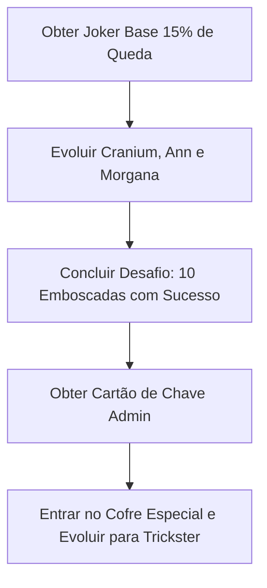

import { Map, Swords, Trophy, Target, Shield, Sparkles } from 'lucide-react'
import { Callout } from '@/components/mdx/Callout'
import { Card, CardGrid } from '@/components/mdx/CardGrid'
import { Checklist } from '@/components/mdx/Checklist'
import { FAQ } from '@/components/mdx/FAQ'
import { Steps, Step } from '@/components/mdx/Steps'
import { Section } from '@/components/mdx/Section'
import { YouTubeEmbed } from '@/components/mdx/YouTubeEmbed'

export const metadata = {
  title: "Anime Universe Tower Defense Boundless Joker: Guia de Expedição",
  description: "Aprenda como desbloquear e evoluir o Boundless Joker (Trickster) de 0,1% no Modo Expedição do Anime Universe Tower Defense com nosso guia passo a passo.",
  category: "Guia",
  image: "https://placehold.co/800x400/1e1b4b/fff?text=Boundless+Joker+Guide",
  date: "2026-07-11",
  author: "Equipe da Wiki do Anime Universe Tower Defense"
}

<Callout type="info" title="Guia Rápido">
- **Boundless Joker**: Desbloqueie o **Boundless Joker** (Trickster) com taxa de queda de 0,1% ao derrotar o chefe do Palácio Dourado.
- **Modo Expedição**: Aprenda a navegar na masmorra furtiva temática de Persona, desviar de sombras e coletar chaves.
- **Sistema de Evolução**: Reúna cartas de Arcana específicas e evolua Cranium, Ann e Morgana para desbloquear o verdadeiro potencial do Joker.
- **Sinergia de Equipe**: Equipe várias unidades com a tag Phantom para ativar multiplicadores de dano massivos e ataques de acompanhamento.
- **Emboscada Ativa**: Maximize seus upgrades para desbloquear a fase de Emboscada ativa, transformando o combate em tempo real em ataques táticos por turnos.
</Callout>

<Section icon={Map} title="Visão Geral do Boundless Joker no Anime Universe Tower Defense">

A atualização temática de Persona introduz o altamente antecipado **anime universe tower defense boundless joker** (conhecido no jogo como Trickster). Como uma unidade de nível Boundless, o Joker possui algumas das mecânicas táticas mais complexas do jogo, mudando completamente a forma como as composições de alto nível operam.

Para obtê-lo, os jogadores devem mergulhar no novo Modo Expedição (especificamente o mapa Palácio Dourado), dominar as mecânicas de furtividade, derrotar guardas de elite e desafiar o chefe Rei Falso.

**Destaques do Vídeo:**
- **Mecânicas de Furtividade**: Aprenda a utilizar esconderijos e dash para evitar as linhas de visão das patrulhas.
- **Encontro com o Chefe**: Assista à luta completa contra o chefe Rei Falso e aprenda estratégias de posicionamento.
- **Caminho de Evolução**: Veja os requisitos exatos necessários para evoluir o Joker para sua forma final.
- **Demonstração**: Observe a sinergia Phantom e a habilidade ativa única de Emboscada por turnos em ação.

<YouTubeEmbed videoId="Scrqko9MBuA" title="Obtendo o 0.1% BOUNDLESS JOKER no Anime Universe Tower Defense!" />

### Requisitos de Entrada da Expedição

Antes de caçar o Joker, familiarize-se com as restrições de loadout. Ao contrário dos modos padrão, a Expedição limita sua equipe com base em um orçamento de pontos rigoroso.

| Raridade da Unidade | Custo de Pontos |
| :--- | :--- |
| **Boundless / Secret** | 50 Pontos / 30 Pontos |
| **Mythic** | 15 Pontos |
| **Legendary** | 5 Pontos |
| **Epic** | 3 Pontos |
| **Orçamento Máximo** | **100 Pontos** |

<Callout type="warning" title="Aviso de Furtividade">
Se uma patrulha de Sombra detectar você, o medidor de detecção deles enche rapidamente. Quebre a linha de visão imediatamente ou prepare-se para ser arrastado para um encontro de combate forçado.
</Callout>

</Section>

<Section icon={Target} title="Como Farmar o Palácio Dourado e Desbloquear o Joker">

Desbloquear o **anime universe tower defense boundless joker** requer uma mistura de furtividade, coleta de chaves e farm de chefe. A taxa de queda base para o Joker do chefe Rei Falso é de aproximadamente 15%, mas um sistema de piedade (pity) garante sua queda em até 8 execuções bem-sucedidas.

### Fluxo de Progressão do Palácio Dourado

| Área do Estágio | Objetivo | Recompensa de Chave |
| :--- | :--- | :--- |
| **Salões do Palácio** | Passe furtivamente pelas Sombras ou execute lutas de Emboscada | Chaves de Bronze e Ouro |
| **Salas Trancadas** | Use chaves para abrir Cofres contendo Baús de Arcana | Cranium, Ann, Morgana |
| **Salas de Elite** | Derrote Guardas de Elite roxos para garantir Itens de Evolução | Evos Chariot, Lovers, Magician |
| **Santuário do Chefe** | Acumule 10/10 pontos para desbloquear e derrotar o Rei Falso | Boundless Joker (Trickster) |

<Steps>
  <Step num="1" title="Inicie a Furtividade e Colete Chaves">
    Navegue pelos corredores usando as zonas de esconderijo vermelhas. Aproxime-se sorrateiramente por trás das Sombras em patrulha e pressione a tecla de interação para desencadear uma Emboscada, começando a batalha com uma enorme vantagem tática.
  </Step>
  <Step num="2" title="Limpe os Encontros de Elite">
    Localize os Guardas de Elite (distinguidos por sua aura roxa). Derrotá-los recompensa você com Chaves de Elite. Use essas chaves em salas laterais trancadas para escolher suas recompensas de Arcana: Chariot, Lovers ou Magician.
  </Step>
  <Step num="3" title="Desbloqueie a Sala do Chefe">
    Você deve acumular 10 pontos ativos limpando salas e derrotando guardas para abrir o Santuário do Chefe. Uma vez desbloqueado, enfrente o Rei Falso em um encontro de defesa de 15 ondas. Derrote-o e vá direto para a Zona de Extração para reivindicar seu saque.
  </Step>
</Steps>

<Callout type="tip" title="Segurança na Extração">
Você deve chegar com sucesso à Zona de Extração e completar a onda de defesa final para manter suas recompensas. Sair mais cedo ou morrer resultará na perda de todas as unidades e itens de evolução adquiridos durante a partida.
</Callout>

</Section>

<Section icon={Sparkles} title="Requisitos de Evolução e Transferência de Atributos">

Depois de obter a unidade Joker base, você deve completar uma série de desafios e evoluir seus companheiros Phantom para despertá-lo em sua forma suprema.

### Dados de Evolução dos Companheiros Phantom

| Nome da Unidade | Carta de Arcana | Item de Evo Necessário | Habilidade Especial |
| :--- | :--- | :--- | :--- |
| **Cranium** | Chariot | Arcana Chariot | Aplica Eletrificar e aumenta Dano Crítico |
| **Ann** | Lovers | Arcana Lovers | Causa Queimadura e reduz a velocidade de inimigos distantes |
| **Morgana** | Magician | Arcana Magician | Causa Corte de Vento e ativa Soco de Sorte |

### Processo de Evolução Passo a Passo

<Callout type="success" title="Dica de Otimização de Atributos">
Antes de evoluir o Joker, utilize a Sala de Mineração para coletar Chips de Atributos de Alto Nível. Transfira atributos de Dano e Alcance de nível S para o Joker antes de seu despertar final para maximizar seus multiplicadores base.
</Callout>

</Section>

<Section icon={Swords} title="Habilidades do Trickster Joker e Sinergia Phantom">

Quando totalmente atualizado, o Joker transforma o campo de batalha. Ele atua como o buffer definitivo e impulsionador de DPS para todas as unidades com a tag Phantom em seu loadout.

### Upgrades de Ataque Base do Joker

| Nível de Upgrade | Dano Causado | Alcance | SPA | Efeito Especial |
| :--- | :--- | :--- | :--- | :--- |
| **Nível 1** | 5.200 | 25 | 6,5s | Tiro de Pistola em Alvo Único |
| **Nível 4** | 45.000 | 40 | 5,5s | Invoca Companheiro Phantom |
| **Nível Máx** | 235.000 | 65 | 4,5s | Desbloqueia Habilidade de Emboscada Ativa |

### Multiplicadores de Sinergia Phantom

O CardGrid permite que você visualize como cada companheiro altera o desempenho do Joker:

<CardGrid cols={3}>
  <Card title="Sinergia Cranium">
    - **Buff de Dano**: Concede +50% de dano a todas as unidades em Emboscada.
    - **Eletrificar**: Causa 25% de dano ao longo de 5 ticks.
    - **Aumento Crítico**: Aumenta a Taxa Crítica em 15%.
  </Card>
  <Card title="Sinergia Ann">
    - **Amplificação de Queimadura**: Aumenta o dano em 25% em alvos afetados.
    - **Controle de Grupo**: Reduz a velocidade de movimento do alvo em 30%.
    - **Utilidade de Atordoamento**: Aplica uma janela de atordoamento de 4 segundos.
  </Card>
  <Card title="Sinergia Morgana">
    - **Soco de Sorte**: 50% de chance de causar o triplo de dano crítico.
    - **Corte de Vento**: Causa 350% de dano ao longo de 7 ticks.
    - **Acompanhamento**: Ativa ataques automáticos de 50% de dano.
  </Card>
</CardGrid>

<Callout type="info" title="A Mecânica de Emboscada Ativa">
Quando o Joker atinge o Upgrade Máximo, ativar sua habilidade inicia uma fase tática por turnos. O tempo congela por 20 segundos, permitindo que seus Phantoms posicionados executem habilidades de alto dano (E-ha, Buofu e Garu) sem sofrer dano das ondas que chegam.
</Callout>

</Section>

<Section icon={Trophy} title="Checklist de Objetivos da Expedição">

Use este checklist para acompanhar seu progresso enquanto farma pela composição definitiva de Ladrão Fantasma no Palácio Dourado.

<Checklist
  id="joker-progression"
  title="Marcos do Ladrão Fantasma:"
  items={[
    "Acumule 100 pontos de loadout para otimizar sua equipe de speedrun",
    "Adquira o Joker base do chefe Rei Falso (taxa de queda de 15%)",
    "Desbloqueie e evolua Cranium, Ann e Morgana usando suas respectivas cartas de Arcana",
    "Complete o desafio de 10 Emboscadas em uma única partida no Palácio Dourado",
    "Adquira o Cartão de Chave Especial para desbloquear o Santuário de Evolução final",
    "Evolua o Joker para Trickster e equipe o conjunto de Chips Warlord"
  ]}
/>

</Section>

<Section icon={Shield} title="Perguntas Frequentes">

<FAQ items={[
  {
    question: "Qual é o melhor orçamento de loadout para farmar o Palácio Dourado?",
    answer: "Como seu orçamento é limitado a 100 pontos, recomendamos usar uma unidade de DPS híbrida forte (como uma Mythic de 15 pontos) para lidar com unidades aéreas, um gerador de dinheiro (como Bulma ou Speaker Idol) e deixar o restante dos pontos para unidades de utilidade."
  },
  {
    question: "Como corrijo o desafio das 10 Emboscadas se meu contador estiver bugado?",
    answer: "Certifique-se de que você está iniciando a luta aproximando-se furtivamente por trás da Sombra e pressionando manualmente o botão de Emboscada. Se a sombra vir você primeiro e iniciar a luta, ela não contará para o requisito do desafio de 10 Emboscadas."
  },
  {
    question: "O chefe Rei Falso tem alguma mecânica especial?",
    answer: "O Rei Falso possui um escudo de 50 milhões de vida. No entanto, ele permanece estacionário por longos períodos, o que o torna altamente suscetível a composições de atordoamento e unidades de alvo único com alto DPS."
  },
  {
    question: "O anime universe tower defense boundless joker é viável para jogo solo?",
    answer: "Sim. Devido à sua habilidade de Emboscada por turnos que congela o movimento dos inimigos, o Joker é uma das principais unidades para limpar desafios solo de alta dificuldade e modos infinitos."
  }
]} />

</Section>